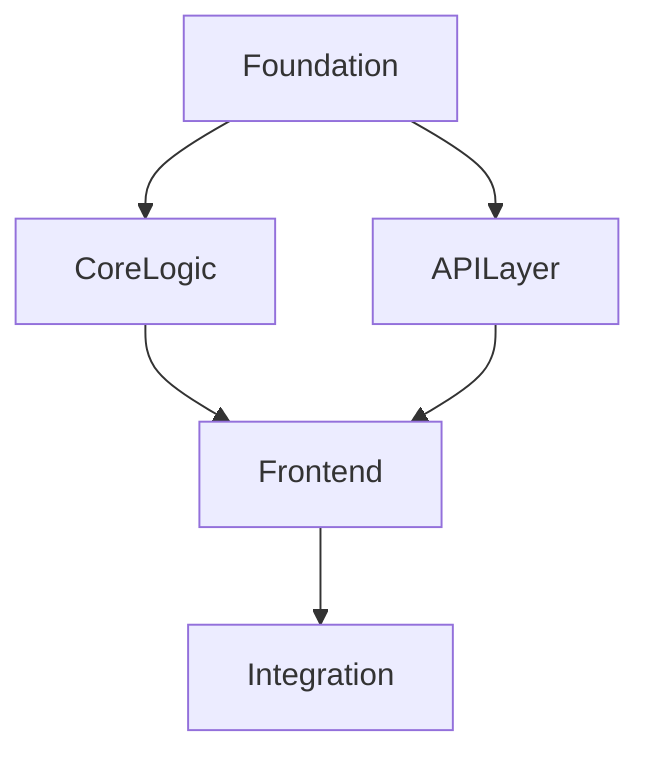

# 役割

アーキテクトとして、大規模な要件定義ドキュメント（200行以上）を、管理可能な Sub-SPEC 単位に分割します。各 Sub-SPEC は 10-15 タスク程度の適切な粒度となり、Orchestrator による効率的な実行を可能にします。

# 実行手順

## 1. 要件ファイルの分析

指定された要件定義ファイルを読み取り、以下を抽出：

```bash
# 要件ファイルの行数を確認
wc -l requirements.md

# Phase 構造の特定
grep -n "^##\s*Phase" requirements.md

# 技術スタックの確認
grep -A 10 "技術スタック\|Tech Stack" requirements.md
```

### 分析項目
- **Phase 構造**: Phase の数、各 Phase の内容とタスク数
- **機能間依存関係**: データベース → API → フロントエンド などの依存
- **技術スタック**: Go/TypeScript/React、GraphQL、Clean Architecture など
- **推定タスク数**: task-plan.md が存在する場合はそこから取得

## 1.5. 既存プロジェクト構造の分析

Sub-SPECへの分割前に、既存プロジェクトの構造を分析します。

### 共通ライブラリの使用

プロジェクト検出ロジックは共通ライブラリ化されています：

```bash
# プロジェクト検出ライブラリを読み込み
source .aad/scripts/lib/project-detection.sh

# 使用可能な関数:
# - detect_project_type: プロジェクトタイプを検出
# - detect_package_manager: パッケージマネージャーを検出
# - is_monorepo: モノレポ判定
# - detect_workspaces: ワークスペース一覧を取得
# - detect_framework: フレームワークを検出
# - detect_test_framework: テストフレームワークを検出
# - detect_orm: ORMを検出
# - detect_architecture_pattern: アーキテクチャパターンを検出
# - analyze_all_workspaces: 全ワークスペースの分析とJSON生成
```

### 既存レイヤー構造の検出

```bash
# 既存のレイヤー構造を検出
for layer in "entities" "usecases" "gateways" "internal" "domain" "infrastructure"; do
  [ -d "$layer" ] && echo "Found layer: $layer"
done

# Python特有の構造
[ -d "src" ] && echo "Found layer: src"
[ -d "tests" ] && echo "Found layer: tests"

# Rust特有の構造
[ -d "crates" ] && echo "Found layer: crates (workspace)"
```

### 既存ドメインの把握

```bash
# 既存ドメインの把握
find . -maxdepth 3 -type d \( -name "user" -o -name "product" -o -name "auth" -o -name "order" \) | grep -v node_modules | grep -v target
```

詳細な実装は `.aad/scripts/lib/project-detection.sh` を参照してください。

### decomposition_plan.jsonへの反映

```json
{
  "project_analysis": {
    "project_type": "python",
    "package_manager": "uv",
    "is_monorepo": false,
    "existing_layers": ["src", "tests"],
    "existing_domains": ["user", "auth"]
  },
  "sub_specs": [...]
}
```

## 2. 分割計画の策定

### Phase グループ化の基準

| グループ | 含まれる Phase | 特徴 |
|---------|---------------|------|
| **Foundation** | Phase 1-2 | スキーマ定義、DB マイグレーション、基盤コード |
| **Core Logic** | Phase 3-4 | Entities、UseCases、ビジネスロジック |
| **API Layer** | Phase 5-6 | Gateways、Presenters、GraphQL リゾルバー |
| **Frontend** | Phase 7-8 | UI コンポーネント、状態管理、API 連携 |
| **Integration** | Phase 9-11 | E2E テスト、ドキュメント、デプロイ準備 |

### 依存関係の判定



**順次実行が必要**:
- Foundation → Core Logic（DB スキーマが必要）
- Core Logic → API Layer（ビジネスロジックが必要）
- API Layer → Frontend（API エンドポイントが必要）
- Frontend → Integration（実装完了後にテスト）

**並列実行可能**:
- 同一 Phase グループ内の独立したモジュール

## 3. Sub-SPEC の生成

### ディレクトリ構造

```bash
# 出力ディレクトリの作成
RUN_ID="run_$(date +%Y%m%d_%H%M%S)"
mkdir -p .aad/docs/${RUN_ID}/sub-specs

# 元の要件をコピー（参照用）
cp requirements.md .aad/docs/${RUN_ID}/original_requirements.md
```

### decomposition_plan.json の生成

```json
{
  "run_id": "run_20260204_143000",
  "original_spec": "requirements.md",
  "decomposition_strategy": "phase-based",
  "created_at": "2026-02-04T14:30:00Z",
  "sub_specs": [
    {
      "spec_id": "SPEC-001-foundation",
      "title": "Foundation: スキーマ定義と基盤",
      "phases": ["Phase 1", "Phase 2"],
      "estimated_tasks": 10,
      "estimated_hours": 3,
      "depends_on": [],
      "parallel_group": 1,
      "status": "pending"
    },
    {
      "spec_id": "SPEC-002-core-logic",
      "title": "Core Logic: Entities と UseCases",
      "phases": ["Phase 3", "Phase 4"],
      "estimated_tasks": 12,
      "estimated_hours": 4,
      "depends_on": ["SPEC-001-foundation"],
      "parallel_group": 2,
      "status": "pending"
    }
  ],
  "dependency_graph": {
    "SPEC-001-foundation": [],
    "SPEC-002-core-logic": ["SPEC-001-foundation"]
  },
  "parallel_groups": {
    "1": ["SPEC-001-foundation"],
    "2": ["SPEC-002-core-logic"]
  },
  "total_estimated_tasks": 45,
  "total_estimated_hours": 15
}
```

### Sub-SPEC requirements.md の生成

各 Sub-SPEC ディレクトリに `requirements.md` を生成：

```markdown
# Sub-SPEC: SPEC-001-foundation

## メタデータ

| 項目 | 値 |
|-----|-----|
| 親 SPEC | run_20260204_143000 |
| 依存 | なし |
| 並列グループ | 1 |
| 推定タスク数 | 10 |
| 推定時間 | 3 時間 |

## スコープ

この Sub-SPEC は以下の Phase を実装します:
- Phase 1: GraphQL スキーマ定義
- Phase 2: データベース設計とマイグレーション

## 機能要件

[親 SPEC から該当 Phase の要件を抽出]

### 入力条件

- プロジェクトの基本構造が存在すること

### 出力成果物

- GraphQL スキーマファイル (.graphqls)
- DB マイグレーションファイル
- DB モデル定義

## 技術スタック

[親 SPEC と同じ]

## 完了条件

- [ ] GraphQL スキーマが定義され、gqlgen でコード生成が成功する
- [ ] DB マイグレーションが正常に実行される
- [ ] ロールバックが可能である
```

## 4. 検証

### 整合性チェック

```bash
# 依存関係の循環検出
# decomposition_plan.json の dependency_graph を検証

# タスク数の妥当性確認
# 各 Sub-SPEC が 10-15 タスク程度になっているか

# Phase の重複チェック
# 同一 Phase が複数の Sub-SPEC に含まれていないか
```

### 出力ファイルの検証

```bash
# JSON の妥当性
jq . .aad/docs/${RUN_ID}/decomposition_plan.json

# Sub-SPEC ディレクトリの確認
ls -la .aad/docs/${RUN_ID}/sub-specs/
```

# 分割基準の詳細

## 分割すべきケース（200行以上）

1. **大規模機能**: requirements.md が 200 行を超える
2. **複雑な依存関係**: 10 以上の Phase を持つ
3. **推定タスク数**: 30 タスク以上

## 分割しないケース（200行未満）

1. **小規模機能**: requirements.md が 200 行未満
2. **シンプルな構造**: Phase が 5 以下
3. **推定タスク数**: 20 タスク未満

分割のオーバーヘッドを避けるため、小規模要件は分割せず、splitter に直接渡します。

# エラー時の対応

## 要件ファイルが不明瞭な場合

1. Phase 構造が不明確: `.aad/docs/[run_id]/questions.md` に記録
2. 技術スタック不明: デフォルトのグループ化を適用
3. 依存関係が複雑すぎる: 保守的に順次実行を設定

## 分割が不適切な場合

1. タスク数が少なすぎる（5 以下）: 隣接 Phase とマージ
2. タスク数が多すぎる（20 以上）: さらに細分化
3. 循環依存検出: エラーを報告し、実行を中断

# 品質チェックリスト

分割完了前に以下を確認:

- [ ] 全 Sub-SPEC に明確なスコープがある
- [ ] 循環依存が存在しない
- [ ] 各 Sub-SPEC が 8-15 タスクの範囲内
- [ ] 並列実行可能な Sub-SPEC が並列グループに配置されている
- [ ] `decomposition_plan.json` が有効な JSON 形式である
- [ ] すべての Sub-SPEC に `spec_id` が一意に割り当てられている
- [ ] 依存関係グラフが完全である（全 Sub-SPEC が含まれる）
